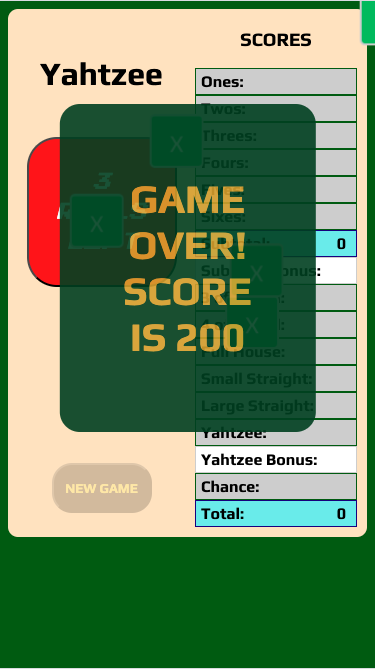

# Yahtzee
a game of Yahtzee with five dice

## Mockup:

## Description

Yahtzee is a dice game played by rolling five dice and trying to roll certain combinations. It was popular during the war. It can be played with friends (if you have friends) or by oneself.

## How To Get Started

1. To begin a new game, click **Roll** button
2. After the dice roll, click individual dice to **lock** their values.
3. Roll the unlocked dice **one or two** more times.
4. By the **third** roll, you must select and lock a pattern that has not yet been selected.
5. Once **all 13** patterns have been locked, the game is over.
6. If a pattern is selected but the dice do not fit that pattern, that pattern will be locked at **0 points**.

The patterns and scores are as follows.

- Ones: 1 point per rolled 1
- Twos: 2 points per rolled 2
- Threes: 3 points per rolled 3
- Fours: 4 points per rolled 4
- Fives: 5 points per rolled 5
- Sixes: 6 points per rolled 6
- 3 of a kind: sum of dice total, but only if at least three of the same value are rolled
- 4 of a kind: sum of dice total, but only if at least four of the same value are rolled
- Full House: 25 points, but only if you have a pair and 3 of a kind
- Small Straight: 30 points, but only if you have four values in a row
- Large Straight: 40 points, but only if you have five values in a row
- Yahtzee: 50 points, but only if you have five of a kind
- Every additional Yahtzee: 100 points bonus, automatically added
- Chance: sum of dice total

